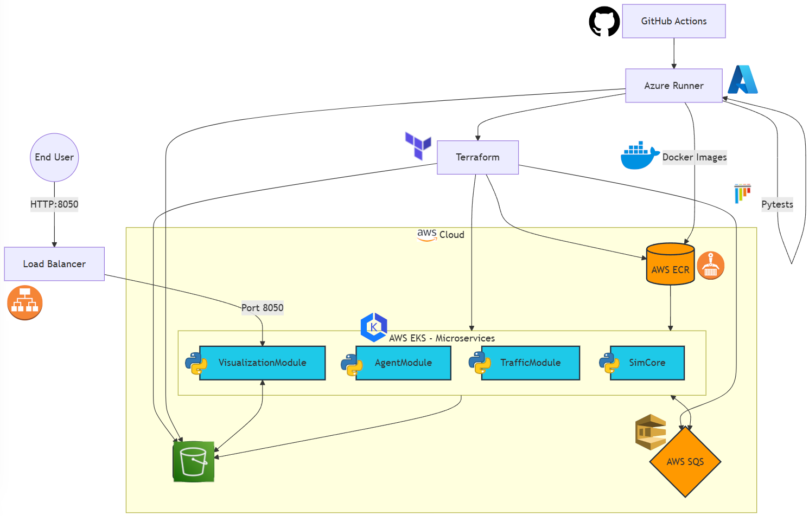

# Traffic Simulation Project

## Cloud-Native Architecture



This project implements a scalable, event-driven traffic simulation system that models vehicle movement, traffic light changes, and road conditions in a custom city. Current features are as follows:
- Real-time traffic simulation at 1 Hz update rate
- Dynamic traffic light control system
- Intelligent vehicle movement with traffic rule compliance
- Road blockage and condition simulation
- Live visualization dashboard
- Event-driven architecture using AWS SQS
- Persistent state management with AWS S3

### Modules

The system consists of four main modules:

1. **SimCore**: Holds current state of the entire simulation.
2. **AgentModule**: Manages vehicle behaviors
3. **TrafficModule**: Controls traffic lights and road conditions
4. **VisualizationModule**: Downloads the simCore state dump and displays live changes

These modules communicate asynchronously through AWS SQS queues, allowing for scalable and decoupled operations. The visualization is not yet separated from simCore (saving on storage cost, sorry).

## Prerequisites

- Python 3.8+
- AWS account with appropriate permissions
- Boto3 library
- Pandas library
- Plotly and Dash libraries for visualization

## Setup

Testing locally

1. Install required packages:
   ```
   pip install -r requirements.txt
   ```

2. Configure AWS credentials:
   - Set up your AWS credentials in `~/.aws/credentials` or use environment variables.
   - Modify bucket name in init_aws.py to your bucket.

3. The docker-compose.yml file orchestrates the required modules and dependencies. To build and start the services, use:
   ```
   docker-compose up --build
   ```

4. Update the `config/config.json` file with your specific AWS region and S3 bucket names

## Visualization

Once the simulation is running, you can view the visualization from the vizModule in AWS EKS. Locally, visit localhost:8050.
```

